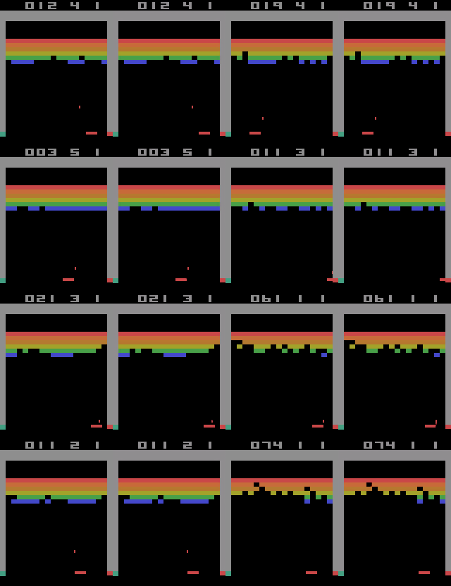
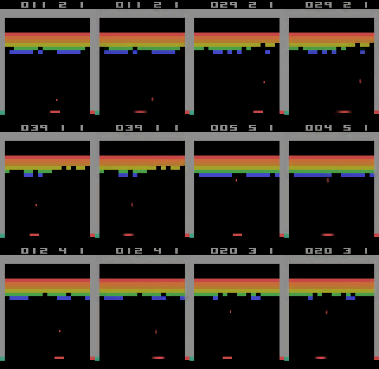

# DQN on Steroids:   An implementation of a multithreaded Double-DQN with a world model 
## [WIP]  
## This Project was build for the Uni-Hamburg Machine Learning course.  

# Usage
you must first train an 'encoder' model with either 'python3 trainState.py' or 'python3 trainDynamics.py'  
You can then call 'trainAgent.py [encodermodel] [--dynamic (optional)]' with the previously trained encoder model and the '--dynamic' flag for the Dynamic Representation.

# About
This is an implementation of a Deep Q-Network but with some addons.  

As environment I chose the "BreakoutNoFrameskip-v4" environment from OpenAI Gym.  
Observations are not directly fed to the DQN but first encoded using another model I train.  

For this I evaluate two approaches:
1. I use an autoencoder to encode the observation into a more dense representation which should help the DQN to learn easier and faster. I call this the state representation because it only encodes one single state.
2. I use an autoencoder that learns to predict the next observation given four previous observations. So that the dense representation includes motion and more understanding of the world. I call this the dynamic representation because it also captures the dynamics of the state.

# State representation
## The network is defined in [nets/StateNetwork.py](nets/StateNetwork.py).  
For the state representation I use a CNN autoencoder.  

The encoded representation has the size of (26, 20, 8). 
The encoded representation is the output of the layer named 'encoding'.  
### Some results are shown here:   
  
The left image alwas shows the ground truth and the right image the prediction.  
That means for each row we have: (Ground truth, Prediction, Ground truth, Prediction)  

As you can see the results are almost perfect.

# Dynamic representation
## The network is defined in [nets/DynamicsNetwork.py](nets/DynamicsNetwork.py)
Now this is the real deal. The state representation only exists such that we have a baseline. This representation gets four observations as input plus an action and predicts the next observation. By this it needs to learn more than only reproduction of a state. It must learn the movement of the ball as well as the movement of the paddle given an action. In conclusion it must learn a world model to reliably predict the future. The encoded representation has the size of (26, 20, 32). The encoded representation is the output of the layer named 'encoding'.  
### Some results are shown here:
  
The left image alwas shows the ground truth and the right image the prediction.  
That means for each row we have: (Ground truth, Prediction, Ground truth, Prediction)

As you can see the results are remarkebly good. Apart from a little blur around the ball and paddle the results seem perfect. Of course the State Represenation doesn't show these artefacts but considering the much more difficult task of future frame prediction compared to frame reconstruction I find these results very much satisfactory.  

The network architecture is very similiar to the StateNetwork's. It has less normalization. The main difference is the use of a custom loss function compared to the State Network using Mean Square Error (MSE). Using the MSE loss the ball dissappeared completely in the networks predictions. Therefor I introduced a custom loss function that uses the power of four instead of the power of two in MSE as well as weights pixels more strongly that have the color of the ball or paddle (they are the same).
The Dynamics Network uses another input that is fed only to the decoder part. For the decoder to be able to predict the movement of the player (the paddle) too, it must know its action. Therefore we also pass the action to the network. Because we have a CNN that works only with 2D data we feed it in as concatenation of a new channel filled with the action.

# Training
The data for training was gathered continously from the environment. Initially the actions were sampled randomly, but this method had a very strong bias towards state with lower scores. The colored bars at the top remained mostly intact and therefore the networks learned to just ignore the minor gaps (if any). Therefor I introduced a simple hardcoded agent that chooses an action based on the position of the paddle with respect to the ball. These positions are extracted from the pixel color values. This simple agent does not score remarkable results (otherwise we could've just stopped the whole experiment and say it's solved) but it scores enough points to cover more diverse states.  
For validation data we use prerecorded data.  
All the data generation and loading is handled in the [datamanager.py](datamanager.py)

I use Tensorboard to track the progress and save example predictions as seen above.  
These are also written to file.  
All this is handled by the [logger.py](logger.py)

**The actual training is done in [trainState.py](trainState.py) for the State representaion and [trainDynamics.py](trainDynamics.py) for the Dynamic Representation**

# DQN
Now that we have a nice encoded representation of the state we train our DQN with it. We can consider these encodings as a preprocessing step in our DQN approach. Whenever we make an observation in the environment we first feed it to the encoder model and then proceed with only its output.

As improvment to the standard DQN I use a [Double DQN](https://arxiv.org/pdf/1509.06461.pdf). That means I use two seperate networks. One for sampling actions with the Q-Values and one to train on the gathered memory. The first network is then updated occasionally. Because we have these two networks and procedures side-by-side I've decided to make them multithreaded. If you take a look into the implementation in [trainAgent.py](trainAgent.py) you'll see two classes that inherit from Thread: Agent and Trainer.
As just described Agent will sample actions using an epsilon greedy approach. It uses its copy of model. The Agent fills its memory with the states and rewards it observes/receives.  
In parallel the Trainer samples from the agents memory and trains its model just as in a vanilla DQN.
After certain amount of epochs (currently set to 1000) the Trainer updates the Agent's model by copying its model's weights to agent's.

## Results are currently underwhelming
I still could not get the agent to really learn but this is still work in progress.

# Implementation
The implementation was done in Keras (Tensorflow 2).  
I used my template subrepo which I've build to provide useful modules for keras projects I always use/need.
